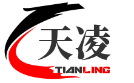

<p align="center">
  
</p>
<h1 align="center">tianLing-nest-admin</h1>
<h4 align="center">基于 Nest.js & Vue.js 的后台权限管理系统</h4>
<p align="center">
	<a href="https://github.com/huyagouban/tianLing-nest-admin-web">
    
  </a>
  <a href="https://github.com/nestjs/nest">
    
  </a>
  <a href="https://github.com/vuejs/vue">
    
  </a>
	<a href="https://github.com/huyagouban/tianLing-nest-admin-web/blob/main/LICENSE">
    
  </a>
</p>

## 简介

- 采用前后端分离的模式。
- 后端使用 `Nest`、`MySQL`、`TypeORM`、`Redis` 等技术。
- 前端使用 `Vue3`、`Element-Plus`、`pinia` 等技术。
- 演示地址：还在完善中。。。
- 文档地址：还在完善中。。。
- 配套后端地址："https://github.com/huyagouban/tianLing-nest-admin-api"

## 前端运行

```bash
# 克隆项目
git clone https://github.com/huyagouban/tianLing-nest-admin-web.git


# 安装依赖
pnpm install

# 启动服务
pnpm serve 

# 打包服务 
pnpm build


```


## 内置功能

- [x] 用户管理：用户是系统操作者，该功能主要完成系统用户配置。
- [x] 菜单管理：配置系统菜单，操作权限，按钮权限标识等。
- [x] 角色管理：角色菜单权限分配、设置角色按机构进行数据范围权限划分。
- [x] 字典管理：对系统中经常使用的一些较为固定的数据进行维护。
- [x] 操作日志：系统操作日志记录和查询。
- [x] 登录日志：系统登录日志记录和查询。
- [x] 在线用户：当前系统中活跃用户状态监控。
- [x] 系统接口：apifox人工维护的接口文档。

## 演示图

<table>
  <tr>
    <td></td>
    <td></td>
  </tr>
  <tr>
    <td></td>
    <td></td>
  </tr>
</table>
